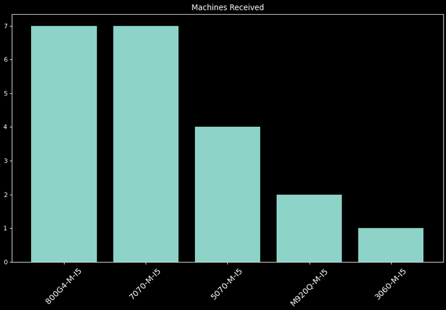
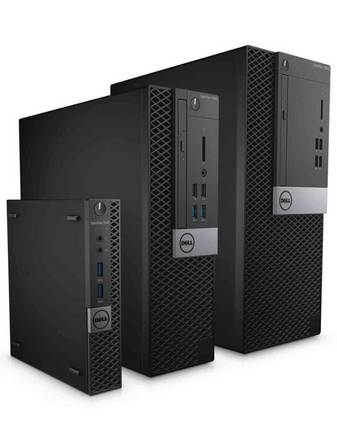

# ninjascripts

## Automate very specific work tasks
---
## Project Overview:
- A file selection dialog box opens allowing browsing to/selection of your desired CSV file.
- CSV is imported and cleaned.
- All serial numbers are printed to the terminal.
- All unique model types along with their total number of machines are printed to the terminal.
- A visualization displays a bar graph of the model data by total number of each machine.
---
**Code and Resources Used**
 - Python 3.9
   - _Pandas_
   - _Matplotlib_
   - _Easygui_
   - _Pyperclip_
 - From the command line, input `pip install -r requirements.txt` from within the project directory to add required modules.
---
### The basics
This program begins by simply opening a (system agnostic) file selection dialog box. Upon navigation to and selection of the proper DT_Export.csv file, the data is extracted to a Pandas dataframe. All serials are printed to the terminal and automatically copied to the (system agnostic) operating system's clipboard. This print serves as a hard method against which to check your serials upon pasting. All models received on the purchase order CSV are then printed to the terminal as well as their totals. Finally, a visualization of total models is displayed.

Two common occurances at my workplace are; the need for every serial number from a certain purchase order, and a quick breakdown of machines received. 
- Often batches of machines will need their statuses shifted, or designated to another warehouse. This is done through a tool on the company's website, however extracting the serials in the past had to be done manually. This is time consuming.
- Each purchase order is an investment. Many orders do not *exactly* match the numbers and types of machines planned during purchasing. The company owners/operators are eager for clear data as fast as possible.
---
#### *Sample Visualizations*:

---
##### **Machine form factors from smallest to largest:**
##### (**M**)ini, (**U**)ltrasmall, (**S**)mall,  (**D**)esktop, (**T**)ower
##### *- First image: Ultrasmall, Small, Desktop, and Tower models 2009-2012*
##### *- Second image: Mini, Ultrasmall, Small models 2012-2020*
---

---
---
## License
[GNU GENERAL PUBLIC LICENSE](LICENSE)